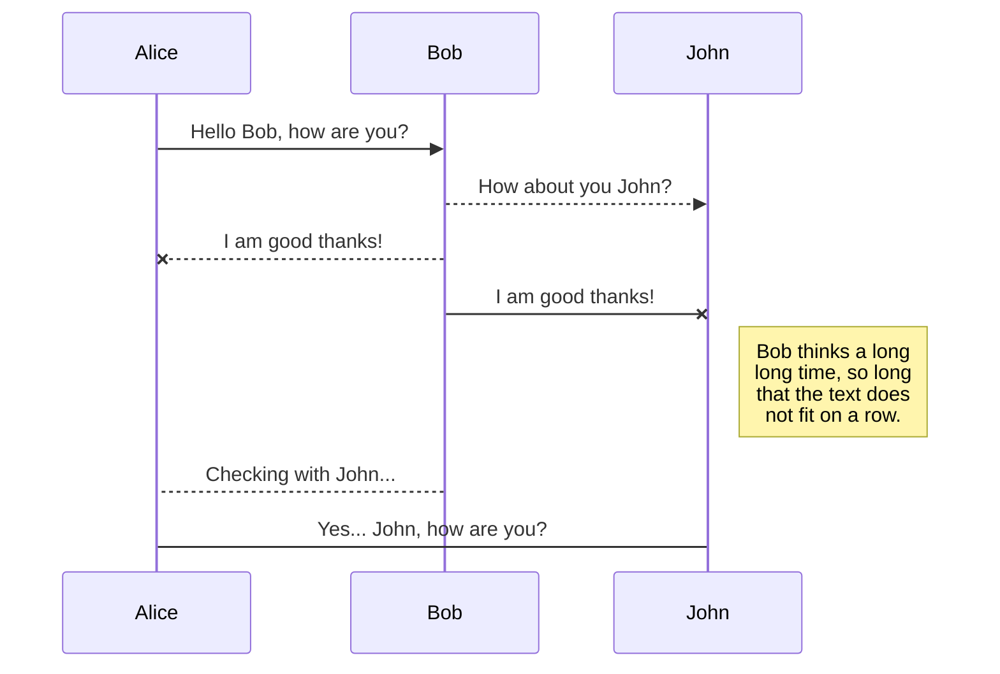
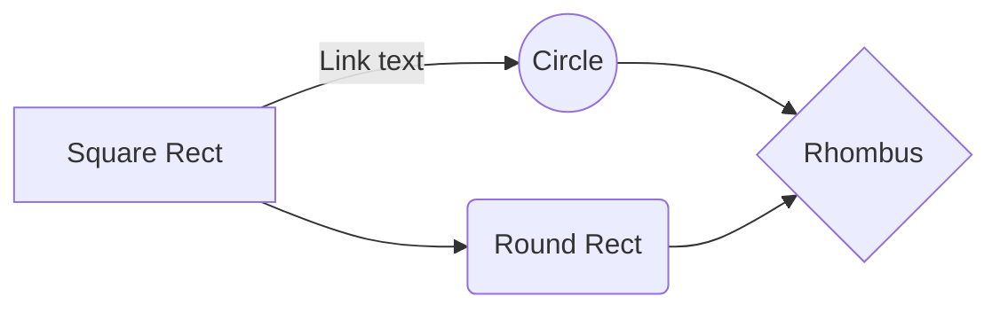

# testovaci-plan
 Three Foxes Lounge Testovací plán Debug Divas Hackathon 2024
# Three Foxes Lounge

## Testovací plán
## Debug Divas

## Hackathon 2024

  
  

Obsah

[1 Úvod  3](https://docs.google.com/document/d/1IIoZbd55stN592l8u5aTmfl6JA5bJ5otzYtUvpe0jxY/edit#heading=h.oevkvjvd8x2p)

[1.1 Obecné informace o projektu  3](https://docs.google.com/document/d/1IIoZbd55stN592l8u5aTmfl6JA5bJ5otzYtUvpe0jxY/edit#heading=h.c6l4snu0zcje)

[1.2 Cíle testovacího plánu  4](https://docs.google.com/document/d/1IIoZbd55stN592l8u5aTmfl6JA5bJ5otzYtUvpe0jxY/edit#heading=h.jlvwjhwto0hk)

[2 Rozsah projektu  4](https://docs.google.com/document/d/1IIoZbd55stN592l8u5aTmfl6JA5bJ5otzYtUvpe0jxY/edit#heading=h.qq3e6fu5ep8)

[2.1 User stories – funkce aplikace  4](https://docs.google.com/document/d/1IIoZbd55stN592l8u5aTmfl6JA5bJ5otzYtUvpe0jxY/edit#heading=h.c7y4iasgi5db)

[2.2 User stories – statické prvky aplikace  6](https://docs.google.com/document/d/1IIoZbd55stN592l8u5aTmfl6JA5bJ5otzYtUvpe0jxY/edit#heading=h.v0fzlargudk4)

[3 Horizonty vývoje a testování aplikace  6](https://docs.google.com/document/d/1IIoZbd55stN592l8u5aTmfl6JA5bJ5otzYtUvpe0jxY/edit#heading=h.gkybn4wbposs)

[3.1 Krátkodobý plán projektu – Hackathon  7](https://docs.google.com/document/d/1IIoZbd55stN592l8u5aTmfl6JA5bJ5otzYtUvpe0jxY/edit#heading=h.bjuvuirwhqxt)

[3.1.1 Týmová příprava  7](https://docs.google.com/document/d/1IIoZbd55stN592l8u5aTmfl6JA5bJ5otzYtUvpe0jxY/edit#heading=h.bejxt733ql8a)

[3.1.2 Stanovení cílů a rozsahu testování  9](https://docs.google.com/document/d/1IIoZbd55stN592l8u5aTmfl6JA5bJ5otzYtUvpe0jxY/edit#heading=h.jaydn8nzsuk1)

[3.1.3 Identifikace testovacích nástrojů a prostředí  10](https://docs.google.com/document/d/1IIoZbd55stN592l8u5aTmfl6JA5bJ5otzYtUvpe0jxY/edit#heading=h.ekxgmrmmcdfx)

[3.1.4 Seznam prohlížečů a zařízení pro testování  10](https://docs.google.com/document/d/1IIoZbd55stN592l8u5aTmfl6JA5bJ5otzYtUvpe0jxY/edit#heading=h.1labu28blrqb)

[3.1.5 Testovací postup  11](https://docs.google.com/document/d/1IIoZbd55stN592l8u5aTmfl6JA5bJ5otzYtUvpe0jxY/edit#heading=h.ikdwojtdspv)

[3.2 Dlouhodobý plán projektu  12](https://docs.google.com/document/d/1IIoZbd55stN592l8u5aTmfl6JA5bJ5otzYtUvpe0jxY/edit#heading=h.sney2ncuoji4)

[3.2.1 Kontinuální zlepšování  12](https://docs.google.com/document/d/1IIoZbd55stN592l8u5aTmfl6JA5bJ5otzYtUvpe0jxY/edit#heading=h.51y30gzeabrm)

[3.2.2 Strategické plánování pro budoucí verze a aktualizace aplikace  12](https://docs.google.com/document/d/1IIoZbd55stN592l8u5aTmfl6JA5bJ5otzYtUvpe0jxY/edit#heading=h.8bo8brjm425n)

[3.2.3 Potenciální rizika testovacího procesu  13](https://docs.google.com/document/d/1IIoZbd55stN592l8u5aTmfl6JA5bJ5otzYtUvpe0jxY/edit#heading=h.u8wmla9minga)

  

# 1 Úvod

## 1.1 Obecné informace o projektu

Významný klient v oblasti hoteliérství zadal vytvoření aplikace pro nové ubytovací zařízení v malebném prostředí anglických lesů. Aplikace musí být připravena k online spuštění do 14 dnů od zadání, protože blížící se lovecká sezóna přiláká do regionu lovce z celého světa. To je ideální příležitost pro zviditelnění nového ubytovacího zařízení, Three Foxes Lounge.

  

Úspěšné a včasné dodání aplikace je zásadní, protože zpoždění či nedodání by mohlo způsobit klientovi výrazné finanční ztráty a negativně ovlivnit začátek nového podnikání. Navíc by mohlo dojít k poškození reputace tohoto exkluzivního ubytovacího zařízení.

  

Vývojářský tým dokázal aplikaci vytvořit během čtyř dní. Před jejím předáním klientovi je však nezbytné provést důkladné testování, aby byla zajištěna její kvalita a funkčnost. Úkolem testovacího týmu je aplikaci otestovat, poskytnout zpětnou vazbu vývojářům a tím přispět k úspěšnému spuštění možností rezervace v daném zařízení.

  

Protože spolupráce s tímto klientem bude pokračovat i po dodání aplikace a projekt bude dále rozvíjen, je důležité myslet i na budoucnost. Vývoj aplikace dneškem nekončí. Není nutné mít vše dokonale implementováno již nyní, ale je klíčové stanovit směr a způsob, jakým se bude testování aplikace v budoucnu ubírat.

  

Tento testovací plán detailně popisuje postupy a metody, které budou použity k zajištění kvality aplikace a definuje klíčové oblasti, které je třeba před spuštěním prověřit. Zároveň doporučuje postup testování v delším časovém horizontu a implementaci nástrojů a postupů sloužící k udržitelnosti projektu.  

## 1.2 Cíle testovacího plánu

-   Identifikace informací o projektu a softwarových komponent, které budou testovány
    
-   Doporučení a popis testovacích strategií, které budou použity během testování
    
-   Identifikace potřebných zdrojů (personál, nástroje) a odhad úsilí potřebného k testování (estimace)
    
-   Vytvoření seznamu výstupů (dokumentů) z testování projektu
    
-   Návrh testovací strategie z dlouhodobého hlediska (budoucnost a udržitelnost projektu)
    

  

# 2 Rozsah projektu

Projekt je definován ve spolupráci zákazníka a Product Ownera, přičemž obsahuje klíčové komponenty k testování, které jsou uspořádány podle jejich priority. Tento přístup umožňuje zaměřit se nejdříve na nejdůležitější funkce, čímž bude zajištěno, že kritické části projektu budou dokončeny včas a podle očekávání. Prioritizace komponent také umožňuje efektivnější plánování a rozdělení zdrojů, což přispívá k hladkému průběhu projektu a minimalizaci rizik spojených s jeho realizací.

  

## 2.1 User stories – funkce aplikace

Funkce

Komponenty

Priorita

Reservation process

Search for available rooms

Highest

Main page room reservation

Highest

Reservation of room from list of available rooms

Highest

Edit search criteria from list of available rooms

Medium

Filtering results using amenities

Medium

Clear filter

Medium

Results sorting

Medium

Filtering results using rating

Low

Filtering results using price

Low

Checkout

Shopping cart

Highest

Checkout page

Highest

Payment methods

Highest

Online payment

Highest

Payment by Check

High

Money transfer

High

Additional facilities

Medium

Terms And conditions

Medium

Confirmation email

Medium

Payment information email

Medium

Guest/Account checkout

Low

Accounts – login/registration

Authentication page

High

Login

High

Log out

High

My account page

High

Create account

Medium

Forgot password

Medium

My Account

Order history and details

High

Order details

High

Credit slips

Medium

My addresses

Medium

My personal information

Medium

  
  

## 2.2 User stories – statické prvky aplikace

Prvek

Komponenta

Priorita

Shared and Common Features

Footer section

High

Header section

Medium

Header – Login in header section

Medium

Header – Shopping cart in header section

Medium

Header – Menu in header section

Medium

Newsletter subscription

Medium

Language switcher

Medium

Main Page

Main sections of home page

Medium

Default language selection

Medium

Interior section

Low

Amenities section

Low

Our rooms section

Low

Testimonials section

Low

Non functional requirements

Website protocol

Highest

GDPR

Highest

SEO optimalization

Medium

  
  

# 3 Horizonty vývoje a testování aplikace

Vývoj a testování aplikace lze efektivně strukturovat na základě dvou časových horizontů: krátkodobého a dlouhodobého. Krátkodobý horizont se zaměřuje na bezprostřední cíle a úkoly, které jsou plánovány pro nadcházející Hackathon. Tento horizont zahrnuje detaily úkolů, jež je nutné splnit během Hackathonu, přidělení rolí a odpovědností v týmu, přípravu prostředí a nástrojů nezbytných pro testování a vývoj, a stanovení konkrétních výstupů a cílů.

  

Naopak dlouhodobý horizont se soustředí na udržitelnost a rozvoj aplikace v průběhu jejího životního cyklu. Tento horizont zahrnuje strategické plánování pro budoucí verze a aktualizace aplikace, definování postupů pro efektivní a kontinuální testování, identifikaci a implementaci osvědčených postupů a metodik pro dlouhodobé testování, doporučení pro implementaci nástrojů a technologií, a plánování školení a rozvoje týmu. Tato struktura umožňuje efektivní řízení jak bezprostředních, tak dlouhodobých cílů, což zajišťuje, že aplikace bude nejen připravena na krátkodobé události, jako je Hackathon, ale také udržitelná a efektivní z hlediska dlouhodobého vývoje a testování.

  

## 3.1 Krátkodobý horizont projektu – Hackathon

### 3.1.1 Týmová příprava

Zhruba týden před konáním Hackathonu jsme naplánovali schůzku spolu s naším mentorem a diskutovali o týmové strategii. Nakonec jsme se dohodli na následujících bodech:

  

1.  Nebudeme mít SCRUM Mastera
    

1.  Vyhovovala nám definice SCRUM týmu jako samořiditelné jednotky s důrazem na vzájemnou spolupráci. V rámci Digitální akademie jsme absolvovaly tři sprinty, během nichž jsme zjistily, že v našich podmínkách SCRUM Master neplní roli tak, jak je obvykle definována (tj. spíše jako kouč). Tři z nás měly možnost si tuto roli během sprintů vyzkoušet. Vzhledem k nedostatku zkušeností s touto seniorní pozicí jsme však v některých sprintech nechtěně sklouzly k tomu, že SCRUM Master fungoval spíše jako projektový manažer, který zadává úkoly. Tohoto přístupu jsme se chtěly vyvarovat.
    

  

2.  Zohlednily jsme také skutečnost, že Hackathon je jednodenní projekt, a proto nebyla role SCRUM Mastera tak nezbytná. Namísto toho jsme potřebovaly maximalizovat počet člověkohodin věnovaných samotnému testování a souvisejícím činnostem. Na druhou stranu jsme již měly zkušenost z předchozích sprintů a dobře jsme se navzájem znaly, což nám umožnilo efektivně využít naše dovednosti a vědět, na koho se můžeme v konkrétních situacích obrátit.
    

  

2.  Příprava podkladů a dokumentace:
    

1.  Sdílený dokument:
    

-   Vzorové šablony pro test case a bug report
    
-   Myšlenková mapa
    
-   Struktura složek v Postmanu pro případné API testy
    
-   Shrnutí pravidel odsouhlasených během uplynulých tří sprintů
    
-   Na co si dávat pozor při reportování v systému Jira
    
-   Jak efektivně pojmenovávat test case a bug report, aby byly snadno pochopitelné a předešlo se duplicitám
    
-   Odkaz na uvedený [Checklist](https://docs.google.com/spreadsheets/d/15ME-jIUTQBHlJ_v-eYZdHrpyr3_4OLuc/edit#gid=1696534826)
    

  

2.  Individuální příprava
    

-   Každá z nás se zaměřila na oblasti, které ji nejvíce zajímaly z hard skills, které jsme se v akademii učily, a ty jsme v rámci našich možností dále rozvíjely
    

  

3.  Připravené základní podklady s ohledem na neznalost zadání:
    

-   Poznámky k testování SQL
    
-   Requesty pro API
    
-   Šablony pro automatizované testy
    
-   Tabulky pro risk-based analýzu
    

  

3.  Individuální seznámení s aplikací
    

-   Doba trvání: minimálně dvě hodiny
    
-   Aktivity:
    

-   Prostředí aplikace a analýza aplikace, exploratory testing
    
-   Dokumentace v systému Jira
    
-   Prostudování dostupných podkladů
    
-   Příprava materiálů potřebných pro testování
    

  

4.  Předem nastavený proces
    

-   Stand-upy po cca 45 minutách maximálně soustředěné práce
    
-   Hlídání délky trvání stand-upu a neodbíhání od témat společných všem
    

  
  

### 3.1.2 Stanovení cílů a rozsahu testování

Analýza aplikace počíná prostudováním obchodních a technických požadavků aplikace a diskusí s Product Ownerem pro lepší porozumění.

Cíl testování: Zajistit správnou funkčnost testované aplikace

Technika:

Testování vybraných funkcí (user stories) s použitím platných a neplatných dat za účelem ověření následujícího:

-   Očekávané výsledky se objeví při použití platných dat.
    
-   Při použití neplatných dat se zobrazí příslušné chybové nebo varovné zprávy.
    

Definition of Ready:

  

US má jasný popis, definované požadavky, stanovenou prioritu.

Dokumentace a technická specifikace je k dispozici.

Testovací prostředí je připravené.

Zadání bylo schváleno stakeholdery (zákazník, product owner).

Jsou k dispozici potřebné nástroje.

Definition of Done:

Všechny plánované testy jsou provedeny.

Všechny chyby s vysokou prioritou a závažností jsou nahlášeny.

Výsledky testů jsou vyhodnoceny, prodiskutovány a schváleny.

Přednost má otestování aplikace a zareportování chyb před vytvářením testovacích scénářů, které by byly znovu nepoužitelné.

Aplikace je responzivní (i pro mobilní zařízení).

Aplikace je bezpečná.

  

Akceptační kritéria:

DOPLNIT

  

Hlavním cílem je test těch komponent aplikace, které jsou označeny jako vysoce prioritní a souvisejí se základní funkčností aplikace. Jedná se konkrétně o následující user stories, ke kterým bude přiřazen konkrétní člen týmu:

Funkce

Komponenty

Priorita

Assigned

Reservation process

Search for available rooms

Highest

Petra S.

Main page room reservation

Highest

Markéta Ch.

Reservation of room from list of available rooms

Highest

Petra S.

Checkout

Shopping cart

Highest

Michaela Š.

Checkout page

Highest

Eva A.

Payment methods

Highest

Inna D.

Online payment

Highest

Inna D.

Non functional requirements

Website protocol

Highest

Simona P. J.

GDPR

Highest

Simona P. J.

  

### 3.1.3 Identifikace testovacích nástrojů a prostředí

Funkce

Nástroj

Reportování testovacích scénářů a chyb

Jira

Zephyr – doplněk k systému Jira

Testování na API vrstvě

Postman

Automatizované testování

Visual Studio Code

Playwright

Vytvoření zálohy

Git Kraken

Github

Práce s databází aplikace

MySQL

Doplňkové

DevTools

Chat GPT v. 4o

Codeium – doplněk pro VS Code

  

### 3.1.4 Seznam prohlížečů a zařízení pro testování

Prohlížeče

  

Zařízení

Chrome

  

Desktop – Windows 10

Firefox

  

Desktop – macOS Sonoma 14.4.1

Safari

  

Android zařízení

Edge

  

iOS zařízení

  

### 3.1.5 Testovací postup

1.  Příprava testovacích případů:
    

-   Vytváření testovacích scénářů na základě požadavků.
    
-   Psaní podrobných testovacích případů s jasnými vstupy, kroky a očekávanými výsledky.
    
-   Vytvoření requestů pro testování na API vrstvě - HODIT DO PROVEDENÍ - [link](https://drive.google.com/file/d/19Din16TSh9rZHc4NBPOnZJbIgGTutAMP/view?usp=share_link)
    
-   Vytvoření automatizovaných testů
    

  

2.  Provedení testů:
    

-   Funkční testování: Ověření, že všechny funkce softwaru fungují podle specifikací.
    
-   Testování kompatibility: Ověření, že software funguje správně na různých webových prohlížečích a různých zařízeních.
    
-   Testování bezpečnosti: Ověření protokolu webové aplikace a právních norem v souvislosti s cílem aplikace.
    
-   Manuální provádění testovacích případů podle předem definovaných kroků.
    
-   Spuštění automatizovaných testů.
    
-   Dokumentace výsledků každého testovacího případu.
    

  

3.  Zaznamenání chyb:
    

-   Identifikace a dokumentace chyb a nedostatků.
    
-   Vytváření podrobných bug reportů s kroky k replikaci, očekávaným a aktuálním výsledkem a prioritou chyby.
    

  

4.  Příprava dokumentace:
    

-   Sestavení zprávy o výsledcích testování, včetně testovacího plánu a hlášení o chybách.
    
-   Shrnutí klíčových nálezů, metrik a doporučení.
    

  
  

## 3.2 Dlouhodobý plán projektu

Níže jsou uvedeny klíčové oblasti zaměřené na zlepšení a strategické plánování testování aplikace, spolu s několika konkrétními kroky a doporučeními.

  

### 3.2.1 Kontinuální zlepšování

1.  Analýza výsledků testování:
    

-   Nutné pro identifikaci slabých míst a oblastí, které potřebují zlepšení.
    
-   Používat tyto analýzy k formulování konkrétních kroků pro zvýšení kvality softwaru.
    

3.  Aktualizace testovacích případů a strategií:
    

-   Na základě požadavků zákazníka průběžně aktualizovat testovací případy a přizpůsobovat testovací strategii.
    

  

### 3.2.2 Strategické plánování pro budoucí verze a aktualizace aplikace

1.  Stanovení kritérií kvality
    

-   Produkt musí fungovat v souladu s požadavky a funkční specifikací
    
-   Konečná verze projektu nesmí obsahovat kritické a blokující chyby.
    

  

2.  Definování postupů pro efektivní a kontinuální testování:
    

-   Vytvoření a udržování procesů, které zajistí konzistentní a efektivní testování všech verzí aplikace.
    
-   Zajištění, že tyto procesy podporují vysokou kvalitu a spolehlivost aplikace.
    

  

3.  Identifikace a implementace osvědčených postupů a metodik:
    

-   Regresní testování: Ověření, že nové změny neovlivní stávající funkcionality.
    
-   Sanity testing (bugfix): Opětovné testování po opravě chyb.
    
-   Automatizace testovacích procesů: Zavedení nástrojů pro automatizované testování k zvýšení efektivity a pokrytí.
    
-   Pravidelné code reviews: Zajištění kvality kódu prostřednictvím pravidelných kontrol.
    

  
  

4.  Doporučení pro implementaci nástrojů a technologií pro:
    

-   automatizované testování
    
-   CI/CD procesy
    
-   testování výkonu (performance testy) v JS v Grafana k6
    
-   integrační testy
    
-   testování API
    
-   testování uživatelského rozhraní z hlediska srozumitelnosti a vizuálního dojmu
    
-   testování použitelnosti a přívětivosti aplikace
    
-   testování spouštění a běhu aplikace: Hodnocení, jak se software spouští a běží na podporovaných prohlížečích a zařízeních, včetně času potřebného ke spuštění
    

  

### 3.2.3 Potenciální rizika testovacího procesu

  

Riziko

Dopad

Preventivní opatření

Testovací tým nemá aktuální a platné dokumenty

Nesprávné testování, možné přehlédnutí chyb

Zajistit, aby tým měl vždy přístup k aktuálním dokumentům

Nedostatek potřebného vybavení, nástrojů, zařízení a softwaru

Zpoždění testovacího procesu, neúplné testování

Připravit a zajistit veškeré potřebné vybavení před zahájením testování

Kritické chyby nejsou opraveny včas

Vysoké riziko výskytu závažných problémů v produkci

Opravit všechny kritické chyby co nejdříve

Chybí poznámky k aktualizaci aplikace nebo jsou nedostatečné

Nejasnosti ohledně nových funkcí a změn, riziko nesprávného použití softwaru

Přikládat poznámky k vydání ke každé nové verzi softwaru, vysvětlit nové prvky a jejich dopad

Neplánované a neprojednané změny a úpravy aplikace

Potenciální destabilizace aplikace, nesoulad s původními požadavky

Zavést proces schvalování a dokumentace všech změn a úprav před jejich implementací

Neprojednané změny v softwaru používaného při vývoji aplikace

Riziko nesouladu mezi vývojem a testovacím týmem, zvýšené náklady na redesign

Zajistit, aby všechny změny v požadavcích byly projednány a schváleny relevantními stranami

  

závěr?# Welcome to StackEdit!

Hi! I'm your first Markdown file in **StackEdit**. If you want to learn about StackEdit, you can read me. If you want to play with Markdown, you can edit me. Once you have finished with me, you can create new files by opening the **file explorer** on the left corner of the navigation bar.

# Files

StackEdit stores your files in your browser, which means all your files are automatically saved locally and are accessible **offline!**

## Create files and folders

The file explorer is accessible using the button in left corner of the navigation bar. You can create a new file by clicking the **New file** button in the file explorer. You can also create folders by clicking the **New folder** button.

## Switch to another file

All your files and folders are presented as a tree in the file explorer. You can switch from one to another by clicking a file in the tree.

## Rename a file

You can rename the current file by clicking the file name in the navigation bar or by clicking the **Rename** button in the file explorer.

## Delete a file

You can delete the current file by clicking the **Remove** button in the file explorer. The file will be moved into the **Trash** folder and automatically deleted after 7 days of inactivity.

## Export a file

You can export the current file by clicking **Export to disk** in the menu. You can choose to export the file as plain Markdown, as HTML using a Handlebars template or as a PDF.

# Synchronization

Synchronization is one of the biggest features of StackEdit. It enables you to synchronize any file in your workspace with other files stored in your **Google Drive**, your **Dropbox** and your **GitHub** accounts. This allows you to keep writing on other devices, collaborate with people you share the file with, integrate easily into your workflow... The synchronization mechanism takes place every minute in the background, downloading, merging, and uploading file modifications.

There are two types of synchronization and they can complement each other:

- The workspace synchronization will sync all your files, folders and settings automatically. This will allow you to fetch your workspace on any other device.
	> To start syncing your workspace, just sign in with Google in the menu.

- The file synchronization will keep one file of the workspace synced with one or multiple files in **Google Drive**, **Dropbox** or **GitHub**.
	> Before starting to sync files, you must link an account in the **Synchronize** sub-menu.

## Open a file

You can open a file from **Google Drive**, **Dropbox** or **GitHub** by opening the **Synchronize** sub-menu and clicking **Open from**. Once opened in the workspace, any modification in the file will be automatically synced.

## Save a file

You can save any file of the workspace to **Google Drive**, **Dropbox** or **GitHub** by opening the **Synchronize** sub-menu and clicking **Save on**. Even if a file in the workspace is already synced, you can save it to another location. StackEdit can sync one file with multiple locations and accounts.

## Synchronize a file

Once your file is linked to a synchronized location, StackEdit will periodically synchronize it by downloading/uploading any modification. A merge will be performed if necessary and conflicts will be resolved.

If you just have modified your file and you want to force syncing, click the **Synchronize now** button in the navigation bar.

> **Note:** The **Synchronize now** button is disabled if you have no file to synchronize.

## Manage file synchronization

Since one file can be synced with multiple locations, you can list and manage synchronized locations by clicking **File synchronization** in the **Synchronize** sub-menu. This allows you to list and remove synchronized locations that are linked to your file.

# Publication

Publishing in StackEdit makes it simple for you to publish online your files. Once you're happy with a file, you can publish it to different hosting platforms like **Blogger**, **Dropbox**, **Gist**, **GitHub**, **Google Drive**, **WordPress** and **Zendesk**. With [Handlebars templates](http://handlebarsjs.com/), you have full control over what you export.

> Before starting to publish, you must link an account in the **Publish** sub-menu.

## Publish a File

You can publish your file by opening the **Publish** sub-menu and by clicking **Publish to**. For some locations, you can choose between the following formats:

- Markdown: publish the Markdown text on a website that can interpret it (**GitHub** for instance),
- HTML: publish the file converted to HTML via a Handlebars template (on a blog for example).

## Update a publication

After publishing, StackEdit keeps your file linked to that publication which makes it easy for you to re-publish it. Once you have modified your file and you want to update your publication, click on the **Publish now** button in the navigation bar.

> **Note:** The **Publish now** button is disabled if your file has not been published yet.

## Manage file publication

Since one file can be published to multiple locations, you can list and manage publish locations by clicking **File publication** in the **Publish** sub-menu. This allows you to list and remove publication locations that are linked to your file.

# Markdown extensions

StackEdit extends the standard Markdown syntax by adding extra **Markdown extensions**, providing you with some nice features.

> **ProTip:** You can disable any **Markdown extension** in the **File properties** dialog.

## SmartyPants

SmartyPants converts ASCII punctuation characters into "smart" typographic punctuation HTML entities. For example:

|                |ASCII                          |HTML                         |
|----------------|-------------------------------|-----------------------------|
|Single backticks|`'Isn't this fun?'`            |'Isn't this fun?'            |
|Quotes          |`"Isn't this fun?"`            |"Isn't this fun?"            |
|Dashes          |`-- is en-dash, --- is em-dash`|-- is en-dash, --- is em-dash|

## KaTeX

You can render LaTeX mathematical expressions using [KaTeX](https://khan.github.io/KaTeX/):

The *Gamma function* satisfying $\Gamma(n) = (n-1)!\quad\forall n\in\mathbb N$ is via the Euler integral

$$
\Gamma(z) = \int_0^\infty t^{z-1}e^{-t}dt\,.
$$

> You can find more information about **LaTeX** mathematical expressions [here](http://meta.math.stackexchange.com/questions/5020/mathjax-basic-tutorial-and-quick-reference).

## UML diagrams

You can render UML diagrams using [Mermaid](https://mermaidjs.github.io/). For example, this will produce a sequence diagram:

And this will produce a flow chart:

